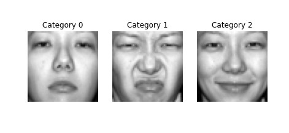
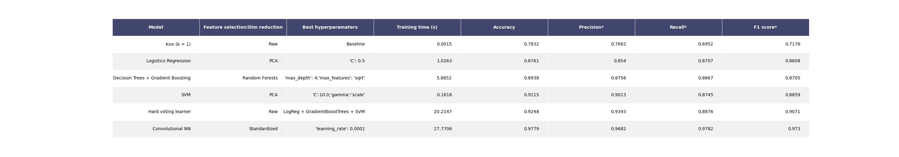

# intro-to-ml-assignment
All final code are in the 'submission folder'.
Report and analysis is in the 'Template Report for Introduction to Machine Learning' file.

Machine learning model to classify people facial expressions.\\

  

*Example dataset*

  

*Result*

